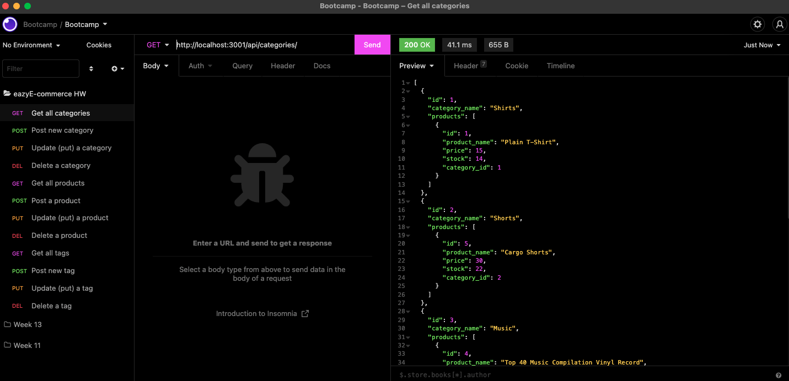

# eazyE-commerce

<div id="top"></div>




<!-- TABLE OF CONTENTS -->
<details>
  <summary>Table of Contents</summary>
  <ol>
    <li>
      <a href="#about-the-project">About The Project</a>
      <ul>
        <li><a href="#built-with">Built With</a></li>
      </ul>
    </li>
    <li>
      <a href="#getting-started">Getting Started</a>
      <ul>
        <li><a href="#prerequisites">Prerequisites</a></li>
        <li><a href="#installation">Installation</a></li>
      </ul>
    </li>
    <li><a href="#usage">Usage</a></li>
    <li><a href="#contact">Contact</a></li>

  </ol>
</details>


<!-- ABOUT THE PROJECT -->
## About The Project

This class project is to create a backend API with Node.js for a mock E-commerce site.

About:
* There are 3 main routes inside this API - /api/categories, /api/products and /api/tags.
* The code leverages Express and Sequelize 
* All API routes are built on the CRUD model and allow create, read, update and delete.


<p align="right">(<a href="#top">back to top</a>)</p>


### Built With

* [Node.js](https://nodejs.dev/)
* [Express.js](https://expressjs.com/)
* [Sequelize](https://sequelize.org/)
* [MySQL](https://www.mysql.com/)


<p align="right">(<a href="#top">back to top</a>)</p>


<!-- GETTING STARTED -->
## Getting Started

To get a local copy up and running follow these simple example steps.

### Prerequisites

* npm
  ```sh
  npm install npm@latest -g
  ```
* mysql
    Download: https://www.mysql.com/


### Installation


1. Install NPM packages
    ```sh
    cd eazyE-commerce && npm install
    ```
2. Source the database. From MySQL CLI interface:
    ```sh
    SOURCE db/schema.sql
    ```
3. Seed the DB
    ```sh
    npm run seed
    ```


<p align="right">(<a href="#top">back to top</a>)</p>


<!-- USAGE EXAMPLES -->
## Usage

Once installed run `npm run start` and the API will be running by default at http://localhost:3001/api. 

- Leverage your favorite API client and GET, POST, PUT, DELETE the endpoints /api/tags, /api/categories and /api/products
- Test with curl:
```sh
curl --request GET \
  --url http://localhost:3001/api/tags
```
- Here is the live link [VIDEO](https://youtu.be/ox_oB6U0IwI) for my eazyE-commerce homework.

<p align="right">(<a href="#top">back to top</a>)</p>


<!-- CONTACT -->
## Contact

Project Link: [https://github.com/kylejames20/eazyE-commerce](https://github.com/kylejames20/eazyE-commerce)

<p align="right">(<a href="#top">back to top</a>)</p>


